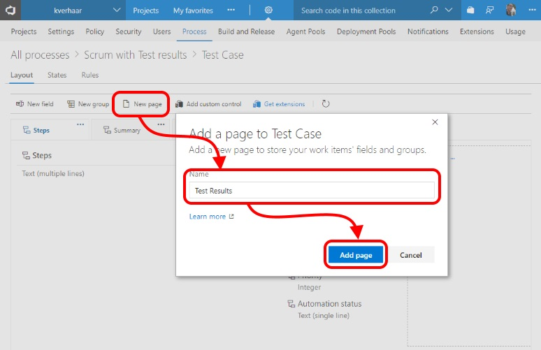
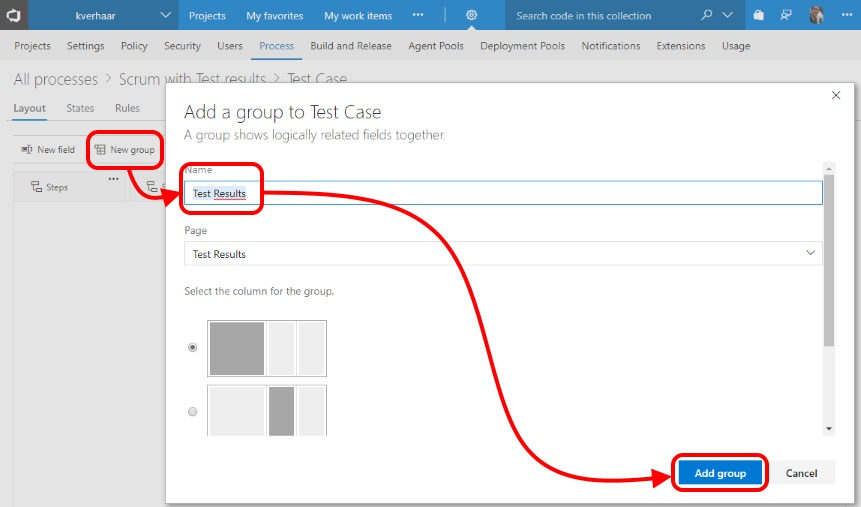
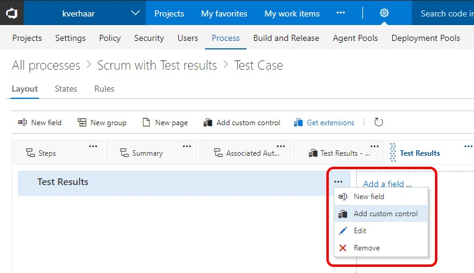
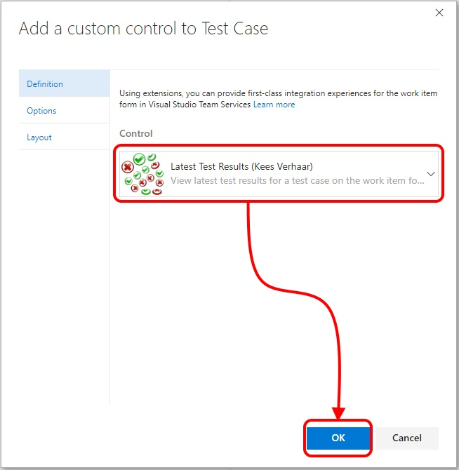
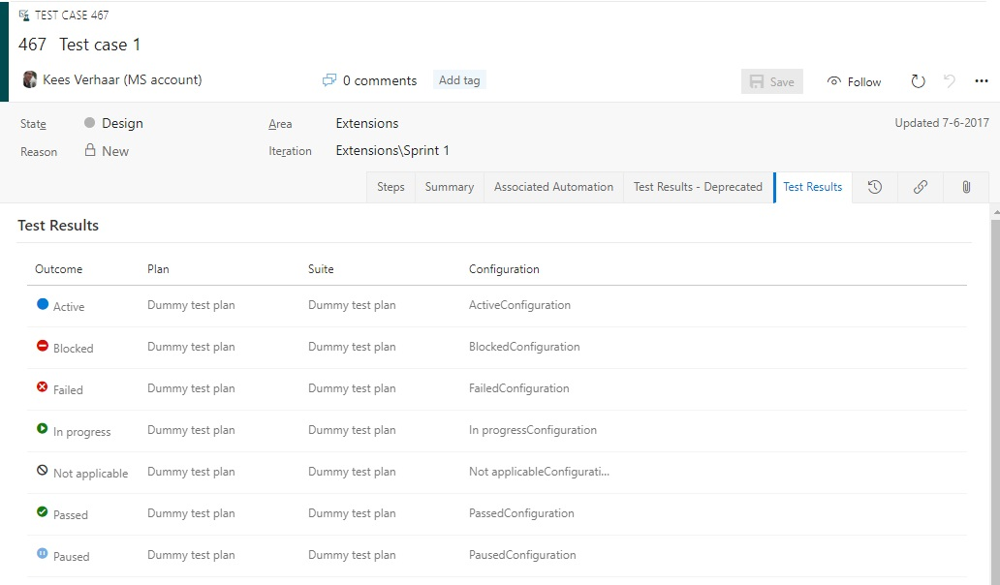
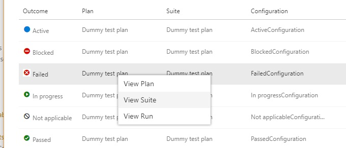

# kv-vsts-ViewLatestTestResult
A custom VSTS extension that displays the latest test results for a test case on the work item form.

# Details
* Adds a custom control that you can add to the `Test Case` work item type
* When loading the control, the extension will:
 * Check if it's loaded from a test case. If the currently opened work item is not a Test Case, an error will be shown.
 * Query VSTS for the test plans, suites and configurations in which this Test Case was included
 * For each test plan, suite and configuration will display the latest test result in a grid
* From each entry in the grid, you can open the context menu to jump to the related test plan, suite or run

# Getting started for VSTS
* Install the extension
* Navigate to the customization page for the `Test Case` work item type in your process template. You might need to create a custom process template first. Refer to [the documentation](https://docs.microsoft.com/en-us/vsts/work/customize/process/customize-process?toc=/vsts/work/customize/toc.json&bc=/vsts/work/customize/breadcrumb/toc.json&view=vsts) to get started with that. Then, add a new page to the work item type.

* Then, add a new group to the new page

* When the group is created, add the custom control to it

* The control doesn't need any configuration, so you can just click OK

* The `Test Case` work item type will now contain an additional tab that shows the latest test results for that Test Case

# Getting started for TFS

In case of TFS, "classic" Process Template customization needs to be applied (changing XML files).

* Install the extension
* Start the Developer Command Prompt (Visual Studio presence is a requirement)
* Execute the following line (replace params with your own), this exports the Test Case definition:
```
witadmin exportwitd /collection:CollectionURL /p:Project /n:"Test Case" /f:FileName
```
* Open the file in a text editor and scroll down to the WebLayout section. Add the following lines just **below** the `<WebLayout>` tag:
```
<Extensions>
   <Extension Id="keesverhaar.viewlatesttestresult" />
</Extensions>
```
* Add the following lines just **above** the closing `</WebLayout>` tag
```
<Page Label="Test results" LayoutMode="FirstColumnWide">
  <Section>
	<Group Label="Test results">
	  <ControlContribution Label="Test results" Id="keesverhaar.viewlatesttestresult.test-results-control">
	  </ControlContribution>
	</Group>
  </Section>
</Page>
```
* Import the Test Case Work Item using the following command (replace params with your own):
```
witadmin importwitd /collection:CollectionURL /p:Project /f:FileName
```

For more information on this procedure, please check the Microsoft documentation: [https://docs.microsoft.com/en-us/vsts/extend/develop/configure-workitemform-extensions?view=vsts](https://docs.microsoft.com/en-us/vsts/extend/develop/configure-workitemform-extensions?view=vsts)

# Screenshots
1. The "Test Results" tab on a Test Case

2. The context menu to jump to related test plan, suite or run


# Contributing
Feel free to fork this repository and submit a pull request if you have any improvements!